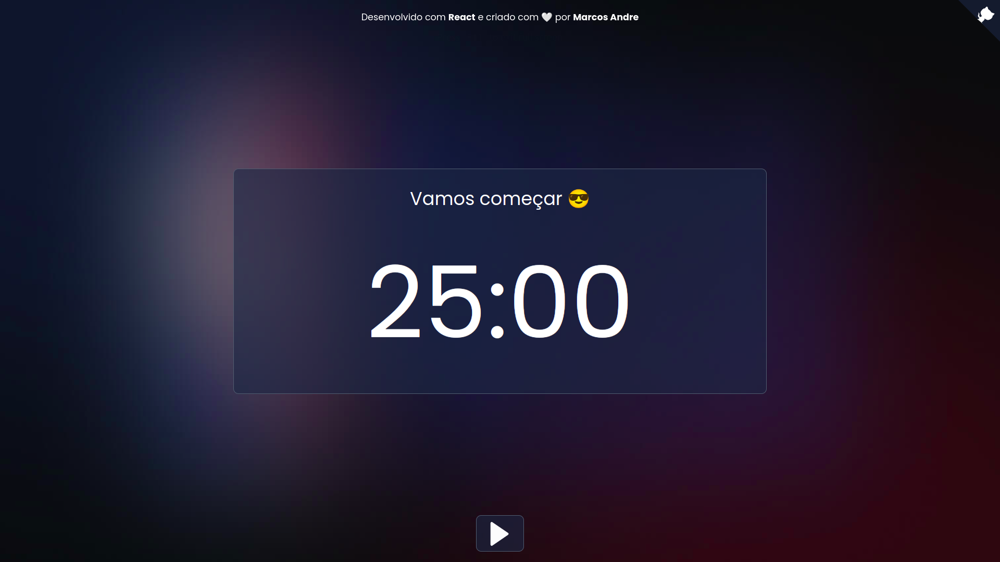

<p align="center">
  <a href="https://pomodoro-iamdevmarcos.vercel.app/" >
    
  </a>
</p>

# Pomodoro Web

Este é o repositório com o código fonte do projeto [Pomodoro Web](https://pomodoro-iamdevmarcos.vercel.app/).

Este é um projeto open source então fique a vontade para contribuir ou fazer o download na sua maquina.

## Tecnologias

- **Front-end:** [React.js](https://reactjs.org/)
- **Styling:** [Styled Components](https://styled-components.com/)
- **Typing:** [TypeScript](https://www.typescriptlang.org/)
- **Deployment:** [Vercel](https://vercel.com/)
- **Build:** [Create React App](https://create-react-app.dev/)

## Teste Online

[Clique Aqui :)](https://pomodoro-iamdevmarcos.vercel.app/)

## Instalação

Você precisará ter apenas o [NodeJS](https://nodejs.org) instalado na sua máquina, e após isso, clonar este repositório:

```sh
  $ git clone https://github.com/iamdevmarcos/pomodoro-web.git
```

Depois disso acesse a pasta e instale as dependências executando o seguinte comando:

```sh
  $ npm install # ou yarn install
```

## Executando a aplicação

Execute o comando abaixo para inicializar a aplicação.

```sh
  $ npm start # ou yarn start
```

## Autor

| [<br><sub>@iamdevmarcos</sub>](https://github.com/iamdevmarcos) |
